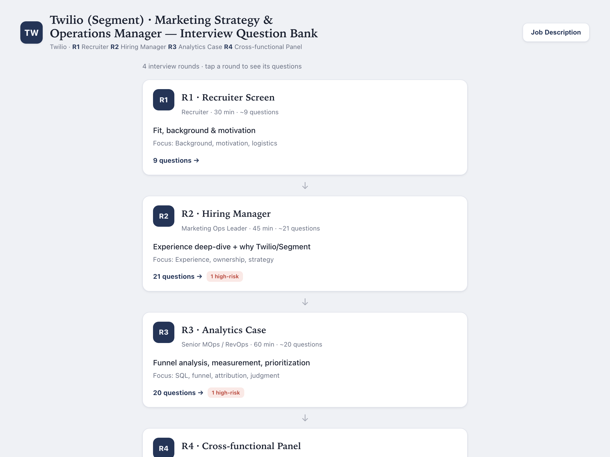
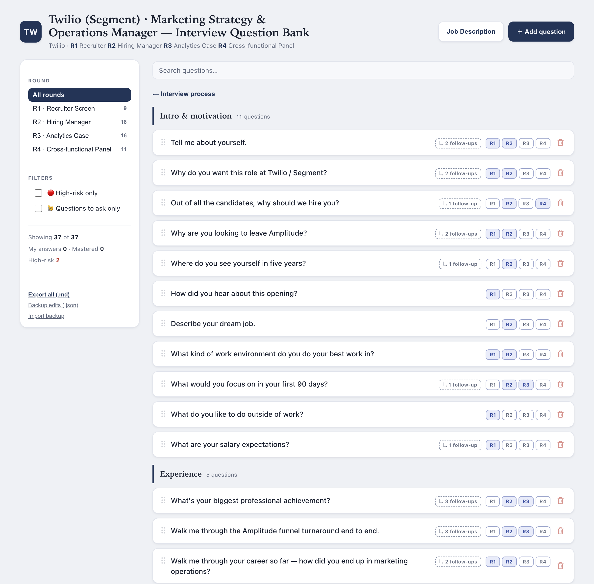
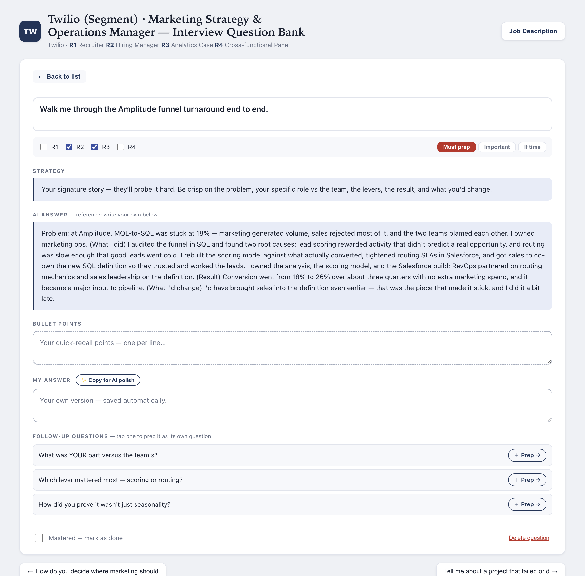

# Interview Q&A Prep

A [Claude Code](https://claude.com/claude-code) skill that turns a **job description + a
candidate's background** into a self-contained, **editable HTML interview Q&A prep app** — a
question bank grouped by interview theme, where every question carries a strategy, a draft
answer, likely follow-ups, and an interview-round tag. Everything is filterable, sortable, and
editable right in the browser, with autosave. No internet needed once generated.

The app is the deliverable: one HTML file the candidate opens in any browser.

**▶️ [Live demo](https://vickywan123.github.io/interview-qa-prep/)** — a sample bank generated for
a (fictional) Marketing Strategy & Operations candidate. Try the round pipeline, filters, the
"Questions to ask" section, and the editable detail view.

## Screenshots

The landing view is the interview pipeline — one card per round:



Inside a round (or "browse all"), questions are grouped into interview-theme sections — Intro &
motivation, Experience, Behavioral, Role skills, Company, and Questions to ask — in a natural
interview order. Drag any card to reorder it:



Each question opens full-page with a strategy, a model answer to study, editable notes, and
likely follow-ups:



## What you get

- **Home page = the interview pipeline** — one card per round (who runs it, duration, question
  count, focus) in a top-to-bottom flow. Tap a round to see its questions, or browse all.
- **Question bank** grouped into **interview-theme sections** (Intro & motivation, Experience,
  Behavioral, Role skills, Company, Questions to ask) in a natural interview order — with a
  sidebar to filter by round, a high-risk toggle, and a "Questions to ask" toggle, plus search.
  Drag any card to reorder it. On mobile the sidebar is a slide-in drawer.
- **Every question opens full-page** with five sections: **Strategy** and **AI answer**
  (read-only reference), plus **Bullet points**, **My answer**, and **Follow-up questions**
  (editable). Round checkboxes are editable inline.
- **Your edits win, forever** — the generated content is a default layer; the moment you edit a
  field it saves to the browser's localStorage and overrides the default, so regenerating the
  file never destroys your work. Export the whole bank to Markdown, or back up / restore as JSON.
- **Auto-backup to a file** (optional; Chrome/Edge) — flip one toggle and pick a file once; every
  edit then auto-saves to that file (overwriting it). Keep it in an iCloud/Dropbox folder and your
  answers survive a cache-clear and follow you to another computer. A manual "Backup edits" button
  is the fallback everywhere else.
- **Bilingual / mixed-language** — English, Chinese, or mixed by round (e.g. a China-team round in
  Mandarin and a global round in English).

## How it works

You never hand-write the HTML. The skill:

1. Reads the JD and the candidate's background.
2. Confirms the interview process (rounds, who, goal) and the interview language.
3. Generates a **spec JSON** (the question bank + draft content).
4. Runs `scripts/build.py`, which injects the spec into `assets/template.html`:

   ```bash
   python3 scripts/build.py spec.json output.html
   ```

The app shell (`assets/template.html`) is already built and tested — the real work is
generating a strong question bank and strong draft content.

## Install

Drop this folder into your Claude Code skills directory:

```bash
git clone https://github.com/Vickywan123/interview-qa-prep.git \
  ~/.claude/skills/interview-qa-prep
```

Then in Claude Code, just describe an interview you're preparing for and hand over the JD —
the skill triggers on requests like "prep me for this interview", "build interview questions", etc. Requires Python 3 (standard library only, no dependencies).

## Layout

```
SKILL.md                        # the workflow Claude follows
assets/template.html            # the app shell (do not re-design per run)
scripts/build.py                # injects a spec JSON into the template
references/spec-schema.md        # the spec JSON schema
references/answer-frameworks.md  # per-question answer structures (CARL, etc.)
```

## License

MIT — see [LICENSE](LICENSE).
